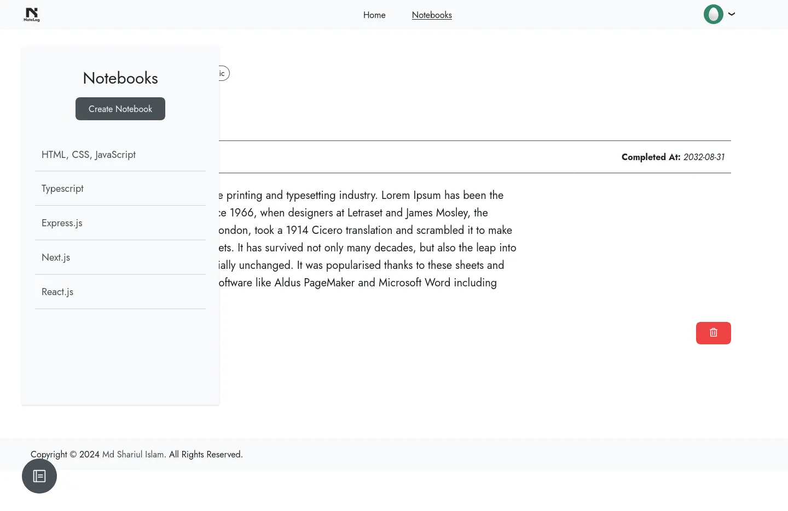
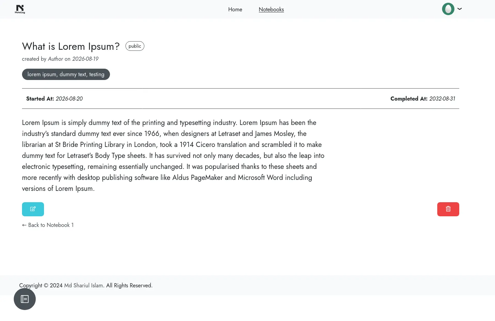
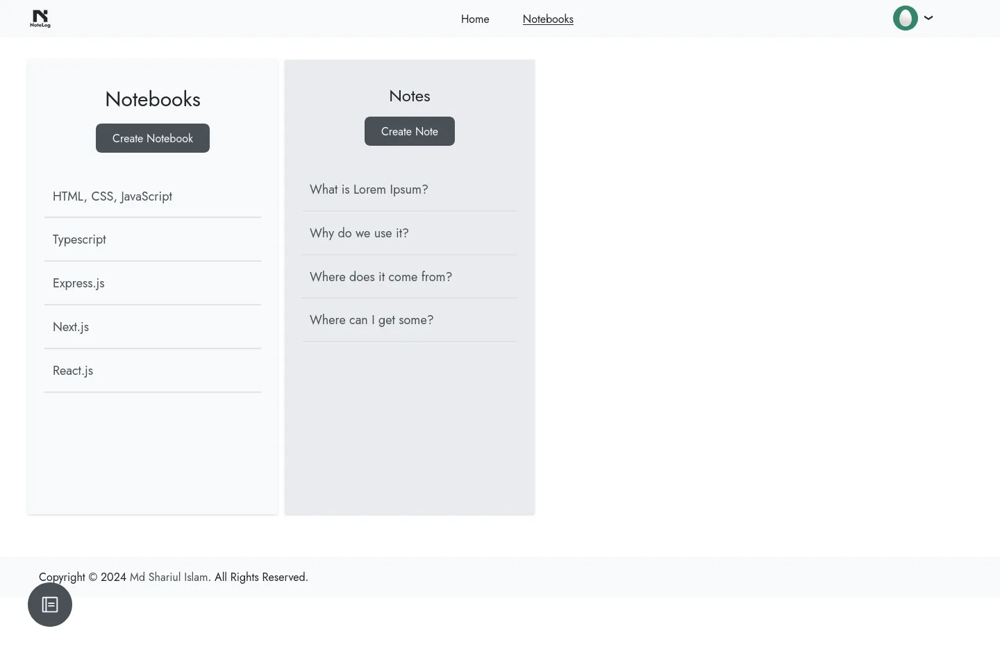

# NoteLog

A simple React.js note taking Web application.

## Technologies Used

- React.js
- React Router
- Redux
- JWT Authentication
- React Hooks
- React Hot Toast

## Features

- Create, Read, Update, and Delete notes
- User authentication and authorization using JWT tokens
- Using RESTful API for backend communication and data stored in MongoDB
- Proper notification system for user actions
- Responsive design for mobile and desktop devices
- React router for navigation between pages
- Redux state management for efficient data handling

## Project Dependencies

- Windows, Mac, or Linux operating system
- Node.js and npm
- Visual Studio Code or any other code editor
- Chrome, Firefox, or any modern web browser

## Run Locally

1. Clone the repository:

```bash
git clone https://github.com/shariult/note-log-reactjs.git
```

2. Change to the project directory:

```bash
cd note-log-reactjs
```

3. Install the dependencies:

```bash
npm install
```

4. Configure the `.env` file in the root directory.

5. Create the complimentary backend server for the application.

6. Start the development server:

```bash
npm start
```

## 📬 Let's Connect & Collaborate!

I am currently open to freelance projects, remote positions, and collaborative opportunities.

[](https://shariul.com) [](https://www.linkedin.com/in/shariul/) [](https://discord.gg/9q5GRgVS2)

## Screenshots




